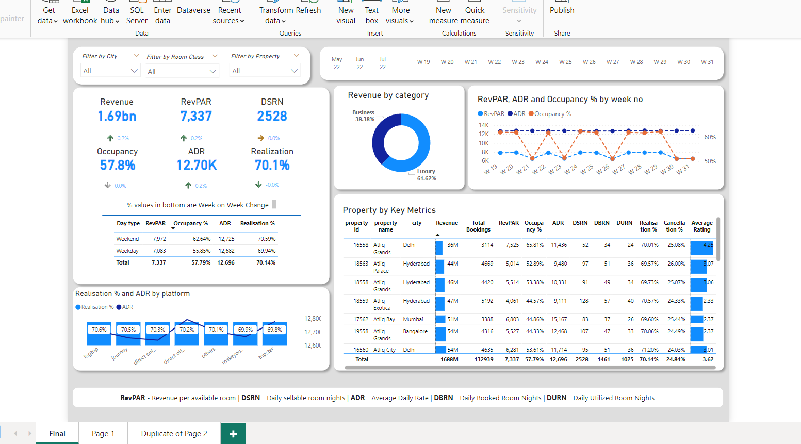

# Provide Insights to Revenue Team in the Hospitality Domain

# Insights for Revenue Enhancement in the Hospitality Domain

## Problem Statement:

AtliQ Grands, a prominent player in the hospitality industry, has been facing challenges with declining market share and revenue in the luxury/business hotels segment. To counter this, the managing director aims to leverage "Business and Data Intelligence" but lacks an in-house data analytics team. The revenue management team has opted for a third-party service provider to derive insights from historical data.

## Task:

As the assigned data analyst, I was tasked with utilizing sample data and a mock-up dashboard to address the following:

1. **Create Metrics** : Develop key metrics as outlined in the metric list.
2. **Dashboard Design** : Implement a dashboard based on stakeholder-provided mock-ups.
3. **Generate Insights** : Uncover additional insights beyond the specified metrics and dashboard.

## Process:

1. **Research & Learning** : Delved into the hospitality business landscape through YouTube videos, gaining insights into revenue management systems, business plans, and the impact of external factors such as COVID-19 on major hotel chains. Discovered valuable terms and industry practices.
2. **Data Exploration** : Imported provided input files into PowerBI, examined tables, and identified metrics. Faced challenges in understanding certain concepts, such as the definition of weekdays in the hotel industry, and sought clarification through guided videos.
3. **Calculated Columns** : Created necessary calculated columns, utilizing functions like PowerBI's weekno() and weekday(). Also, explored how to modify weekdays based on specific requirements.
4. **Measures Creation** : Developed measures by delving into DAX formulas and functions, learning about useful tools like HASONEFILTER, ALL, CALCULATE, and FILTER. This process involved both subject matter expert guidance and independent exploration.
5. **Dashboard Creation** : Spent considerable time designing and refining the dashboard, taking inspiration from the provided mock-up and leveraging newfound knowledge.

**Problem Statement :**

AtliQ Grands owns multiple five-star hotels across India. They have been in the hospitality industry for the past 20 years. Due to strategic moves from other competitors and ineffective decision-making in management, AtliQ Grands are losing its market share and revenue in the luxury/business hotels category. As a strategic move, the managing director of AtliQ Grands wanted to incorporate “Business and Data Intelligence” to regain their market share and revenue. However, they do not have an in-house data analytics team to provide them with these insights.

Their revenue management team had decided to hire a 3rd party service provider to provide them with insights from their historical data.

**Task:**

You are a data analyst who has been provided with sample data and a mock-up dashboard to work on the following task.

1. Create the metrics according to the metric list.
2. Create a dashboard according to the mock-up provided by stakeholders.
3. Create relevant insights that are not provided in the metric list/mock-up dashboard.

NOTE : There some input files that have given  to in 'Input Files' folder

Process :

1. Watched some videos on hospitality business on youtube, get to know some general terms , like RMS (revenue management system), about mahindra hotels bussiness plan, their club mahindra membership, how covid affected big hotels gaints drag them to losses, i found a really intersenting video on data analytic case study on hostpitality bussiness which was very informative, learned about so many terms used in hotels like (vacant clean, dirty clean, out of service, internal channel, external channel for bookings etc.), way they collect data for analysis, how they can help with analysis, some frauds .
2. Imported given input files to PowerBI saw tables, saw metrics to create from metric table still there are things which i was not getting like confusion between weekday (because in hotel industry they consider friday, saturday as weekend and other days as weekdays), so watched guided video ( mock up review and discussion part which was very helpful for me to understading metrics created also watching videos on hostlity bussiness also helped me to understand them fast)
3. Now created 2 calculated columns mentioned in metrics list, learned about powerBI weekno( ) and weekday( ) function also saw how to change weekday according to requriments
4. Creating measures, thinking will i think of these measures myself although some will be told by subject matter expert but some of them i have to think and create by myself, i have to learn more about dax measures and formulas although while creating learned about some like (**HASONEFILTER** - to check if there is filter applied or not, **ALL** - to remove appplied filters, **CALCULATE** - return expresion or calculation with some filters you can apply, **FILTER** - creates a table which has rows with specific conditions used mostly inside CALCULATE).
5. After spending hours on Dashboard below is the dashboard

6. **Continuous Improvement** : Recognized the potential for further enhancements, particularly in the tooltip segment, acknowledging the iterative nature of the project.
7. **Reflection** : This project served as a valuable learning journey, expanding my understanding of the hospitality industry, refining my DAX skills, and elevating my dashboard design proficiency.
